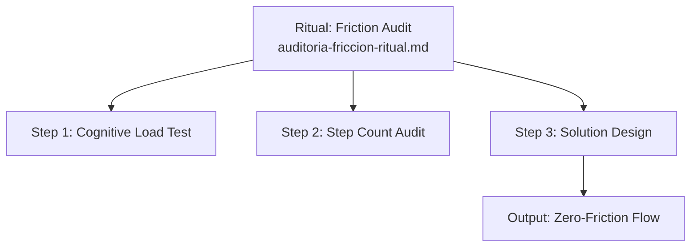

# Knowledge Graph: Friction Audit

```mermaid
graph TD
    RITUAL["Ritual: Friction Audit<br/>auditoria-friccion-ritual.md"] --> S1["Step 1: Cognitive Load Test"]
    RITUAL --> S2["Step 2: Step Count Audit"]
    RITUAL --> S3["Step 3: Solution Design"]
    S3 --> T1["Output: Zero-Friction Flow"]
```
