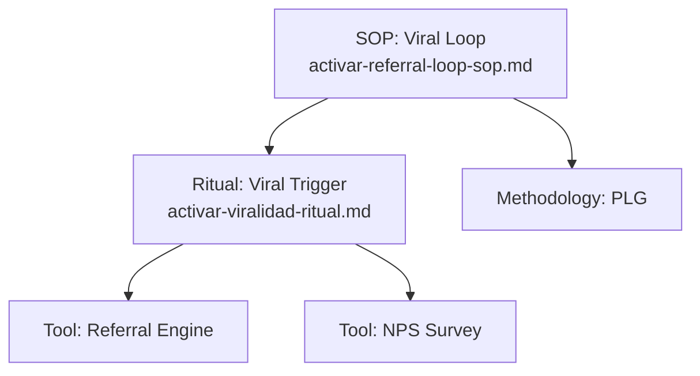

# Knowledge Graph: Success B2C

```mermaid
graph TD
    SOP["SOP: Viral Loop<br/>activar-referral-loop-sop.md"] --> R1["Ritual: Viral Trigger<br/>activar-viralidad-ritual.md"]
    SOP --> M1["Methodology: PLG"]
    R1 --> T1["Tool: Referral Engine"]
    R1 --> T2["Tool: NPS Survey"]
```
