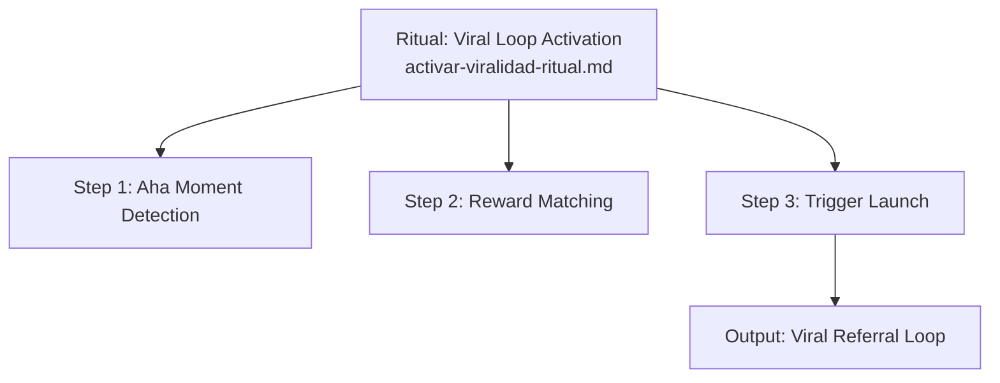

# Knowledge Graph: Viral Loop

```mermaid
graph TD
    RITUAL["Ritual: Viral Loop Activation<br/>activar-viralidad-ritual.md"] --> S1["Step 1: Aha Moment Detection"]
    RITUAL --> S2["Step 2: Reward Matching"]
    RITUAL --> S3["Step 3: Trigger Launch"]
    S3 --> T1["Output: Viral Referral Loop"]
```
