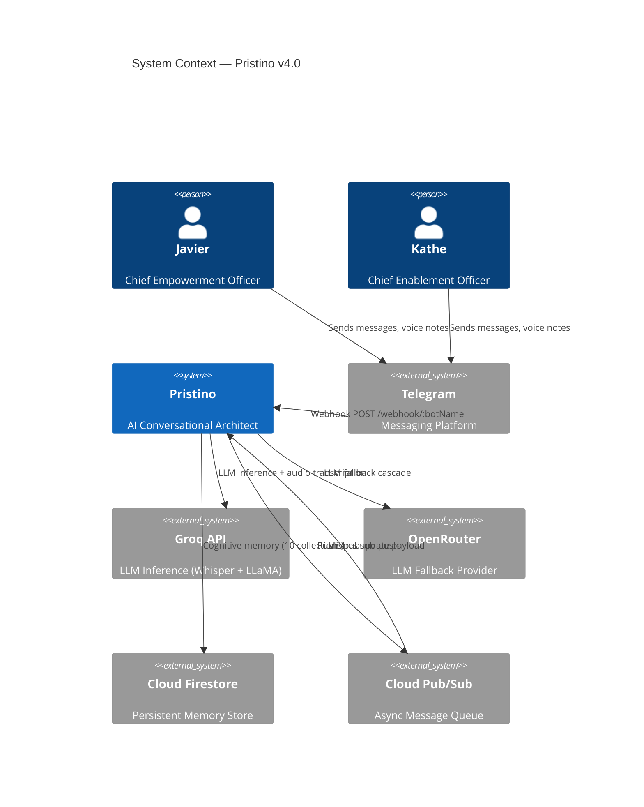
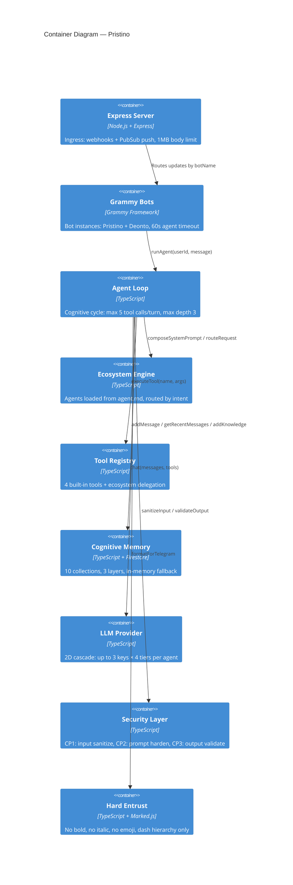
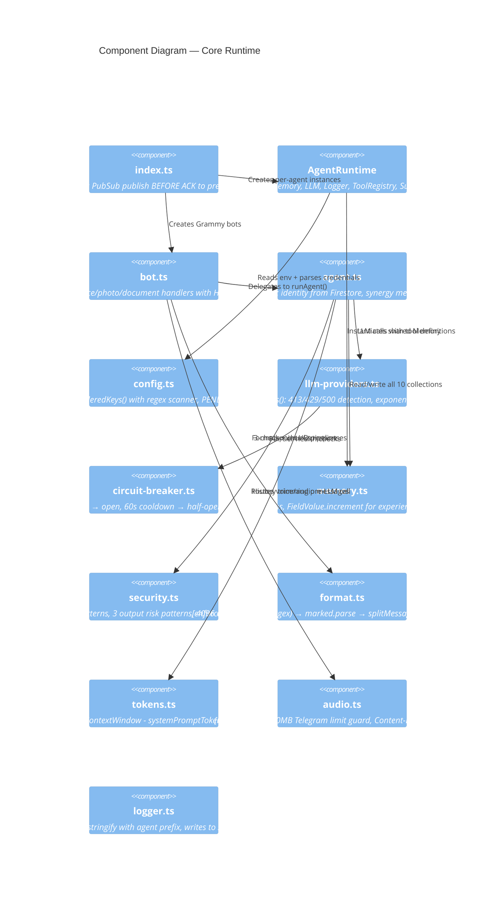
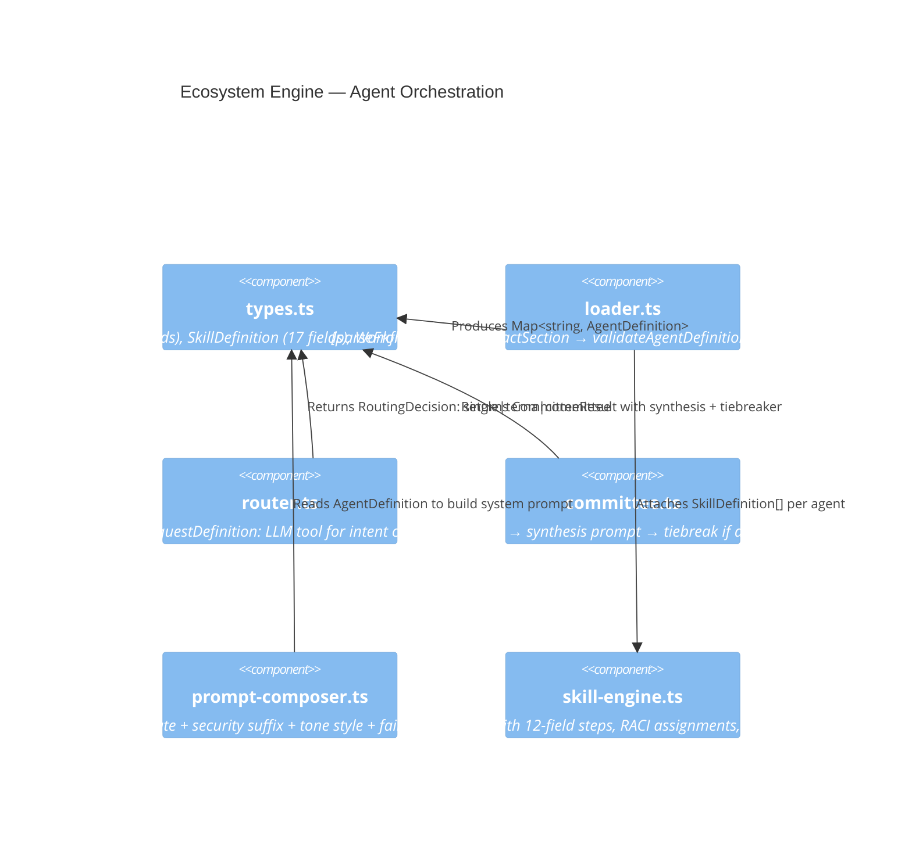
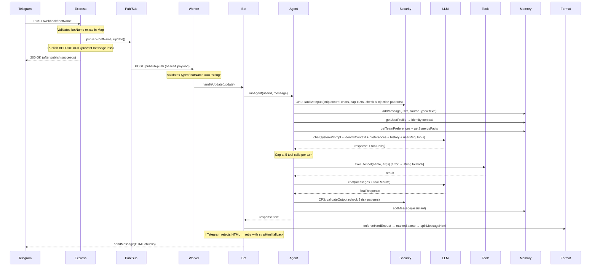

# Pristino — Architecture Overview

> v4.0 | 24 source files | 3,997 LOC | Node.js 20 + TypeScript 5.x | Firebase + Groq + OpenRouter

## Design Rationale

Pristino is a **multi-agent conversational AI** built for a 2-person team (Javier, Kathe) operating MetodologIA. The architecture prioritizes: (1) fault isolation between agents so one failing key doesn't kill both bots, (2) async processing so Telegram never sees a timeout, and (3) a cognitive memory model where knowledge persists beyond conversation TTL.

**Why not a monolith?** Each agent (Pristino/Deonto) needs its own Telegram token, LLM key pool, and memory silo. A single-process monolith with a shared registry would create cascading failures; independent `AgentRuntime` instances isolate blast radius to a single agent.

**Why Express + PubSub instead of Grammy long-polling?** Long-polling holds a persistent connection per bot. On Cloud Run, this means paying for idle containers. The webhook+PubSub pattern decouples ingress (fast 200 OK) from processing (background worker), enabling scale-to-zero and retry semantics on failures.

## System Context (C4 Level 1)

**Boundary decisions:**

- Telegram was chosen over WhatsApp because Grammy provides typed SDK + middleware; Twilio WhatsApp requires webhook parsing from scratch.
- Groq is primary LLM (free tier, fast inference); OpenRouter is fallback (paid, broader model access). The 2D cascade tries all Groq keys × all tiers before falling to OpenRouter.
- Firestore was chosen over PostgreSQL for zero-ops serverless persistence; trade-off is no JOINs (mitigated by denormalized document design).

## Container Diagram (C4 Level 2)

**Key limits and acceptance criteria:**

- Express body limit: 1MB (down from 50MB after adversarial audit); prevents RAM saturation DoS.
- Agent timeout: 60s hard cap in bot.ts; Cloud Run's request deadline enforces this server-side.
- Tool calls: capped at 5 per LLM turn to prevent runaway execution loops.
- Recursion depth: max 3 levels of sub-agent delegation; deeper requests return error string.
- Content length: 32KB max per Firestore field; larger payloads require Cloud Storage URIs.
- Message history: context-budget-aware trimming via `tokens.ts`; oldest messages dropped first.

## Component Diagram (C4 Level 3)

## Ecosystem Architecture (C4 Level 3)

**Design decision — why terna/committee?** For high-stakes queries (strategy, architecture), routing to 2-3 agents provides diverse perspectives. The committee module runs agents in parallel, then synthesizes responses. Trade-off: 2-3x LLM cost per query; mitigated by router only escalating when confidence is low.

## Request Flow

**Edge cases handled in this flow:**

- PubSub publish fails → HTTP 500 returned to Telegram → Telegram retries (instead of silent message loss)
- LLM returns empty response → "I have nothing to say." fallback
- Tool execution throws → error message returned as tool result string (agent loop continues)
- Agent loop exhausts maxIterations → "I got stuck in a loop" response persisted to memory
- Telegram HTML parse fails → bot retries with plain text fallback (`stripHtml`)
- Voice message received → audio.ts transcription → message stored with `sourceType: "voice_transcription"`

## Known Architectural Limitations

| Area            | Limitation                                      | Impact                                                                | Mitigation Path                                    |
| --------------- | ----------------------------------------------- | --------------------------------------------------------------------- | -------------------------------------------------- |
| Concurrency     | No per-user message queue                       | 5 rapid messages = 5 parallel `runAgent` calls consuming 5x API quota | Implement userId-keyed queue in bot.ts             |
| Webhook auth    | No `X-Telegram-Bot-Api-Secret-Token` validation | Attacker with webhook URL can send fake updates                       | Add secret token validation in Express middleware  |
| Circuit breaker | State in-memory, lost on restart/scale          | New instances start with all breakers closed                          | Accept: cold start retry cost is low               |
| RAG             | No embedding pipeline yet                       | `searchRagChunks` does naive text containment                         | Implement Vertex AI embeddings + `findNearest`     |
| Thread creation | No Firestore transaction                        | Two simultaneous messages from same user = two threads                | Wrap in `runTransaction`                           |
| Security        | Regex-only injection detection                  | Bypassable with Unicode homoglyphs                                    | Accept: model RLHF is the real defense             |
| Memory          | In-memory fallback loses all state on restart   | Dev-only; production always uses Firestore                            | Document clearly; never deploy without credentials |

## File Index

| File                           | LOC | Hardening Status                   | Key Constants                                                  |
| ------------------------------ | --- | ---------------------------------- | -------------------------------------------------------------- |
| `index.ts`                     | 218 | Adversarial-hardened (Fase 8)      | Body limit 1MB, PubSub topic configurable                      |
| `runtime.ts`                   | 61  | Clean                              | DI container, no external state                                |
| `bot.ts`                       | 193 | Excellence Loop (Fase 6)           | AGENT_TIMEOUT_MS=60000                                         |
| `agent.ts`                     | 293 | Adversarial + Cognitive (Fase 8-9) | MAX_DEPTH=3, MAX_TOOL_CALLS_PER_TURN=5                         |
| `config.ts`                    | 194 | Excellence Loop (Fase 6)           | Pre-compiled regex, Math.max guards                            |
| `config/llm-providers.ts`      | 304 | Excellence Loop (Fase 6)           | 413 detection, abort timeout                                   |
| `memory.ts`                    | 540 | Cognitive Model (Fase 9)           | MAX_CONTENT_LENGTH=32768, TTL_DAYS=30                          |
| `format.ts`                    | 235 | Adversarial-hardened (Fase 8)      | TELEGRAM_MAX_LENGTH=4096, LIFO tag close                       |
| `security.ts`                  | 79  | Excellence Loop (Fase 6)           | 8 injection patterns, 3 output patterns, MAX_INPUT_LENGTH=4096 |
| `tokens.ts`                    | 50  | Clean                              | Budget = context - system - reserve                            |
| `circuit-breaker.ts`           | 58  | Clean                              | 5 failures → open, 60s cooldown                                |
| `audio.ts`                     | 78  | Excellence Loop (Fase 6)           | 20MB Telegram limit guard                                      |
| `logger.ts`                    | 38  | Clean                              | JSON to stdout                                                 |
| `ecosystem/types.ts`           | 156 | Stable                             | 7 interfaces, 1 type alias                                     |
| `ecosystem/loader.ts`          | 269 | Stable                             | 21 mandatory + 4 optional agent fields                         |
| `ecosystem/router.ts`          | 158 | Stable                             | 3 routing modes                                                |
| `ecosystem/committee.ts`       | 176 | Stable                             | Parallel execution + synthesis                                 |
| `ecosystem/prompt-composer.ts` | 72  | Stable                             | Mandate+security compose                                       |
| `ecosystem/skill-engine.ts`    | 148 | Stable                             | 12-field step definitions                                      |
| `tools/registry.ts`            | 124 | Stable                             | Error isolation per tool                                       |
| `tools/delegate.ts`            | 138 | Stable                             | Depth-guarded delegation                                       |
| `tools/knowledge.ts`           | 76  | Stable                             | team_core_docs/ reader                                         |
| `tools/get-current-time.ts`    | 42  | Stable                             | Timezone-aware                                                 |
| `tools/symlink.ts`             | 84  | Stable                             | OpenClaw registry symlinks                                     |
