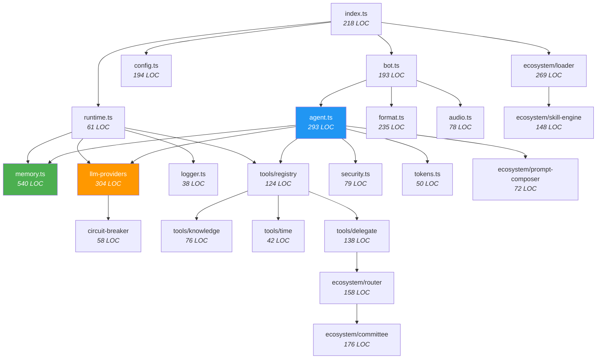

# Pristino — Component Catalog

> 24 modules | 4 layers | 3,997 LOC | 7 external dependencies

## Design Invariants

Every component in Pristino adheres to three invariants: (1) **fault isolation** — a crash in any tool, LLM call, or Firestore operation never propagates upward; all errors resolve to string fallbacks. (2) **Stateless processing** — no module holds request-scoped state between calls; all persistence goes through Memory. (3) **No implicit coupling** — dependencies flow downward through layers; ecosystem modules cannot import from core (prevents circular deps).

## Core Layer — Orchestration and Lifecycle

| Component          | File         | LOC | Responsibility                                                                                                                                                                                                                                                                                                                                     | Key Invariant                                         | Dependencies                                       |
| ------------------ | ------------ | --- | -------------------------------------------------------------------------------------------------------------------------------------------------------------------------------------------------------------------------------------------------------------------------------------------------------------------------------------------------- | ----------------------------------------------------- | -------------------------------------------------- |
| **Entrypoint**     | `index.ts`   | 218 | Express server (webhook mode) or Grammy long-poll (dev mode). PubSub publish completes BEFORE returning HTTP 200 to prevent message loss. Validates `typeof botName === "string"` on PubSub payloads.                                                                                                                                              | No message loss: ACK after publish                    | config, runtime, bot, ecosystem                    |
| **AgentRuntime**   | `runtime.ts` | 61  | Per-agent dependency injection container. Each runtime is fully isolated: own Memory instance, own LLM provider (with its own key pool), own Logger prefix, own ToolRegistry. Multiple runtimes share Config but nothing else.                                                                                                                     | Agent isolation: no shared mutable state              | config, memory, llm-providers, logger, tools       |
| **Bot Factory**    | `bot.ts`     | 193 | Creates Grammy bots with handlers for: text (`on("message:text")`), voice/audio (`on("message:voice")`, `on("message:audio")`), photo, document. Wraps `runAgent()` in 60s timeout. If Telegram rejects HTML parse, retries with `stripHtml` plaintext fallback.                                                                                   | Never fails to deliver: HTML → plaintext fallback     | runtime, agent, format, audio                      |
| **Cognitive Loop** | `agent.ts`   | 293 | The core AI execution engine: builds secure prompt (CP2), loads conversation history, injects user identity from Firestore (with `FALLBACK_IDENTITIES` constant), injects team preferences + synergy facts, calls LLM with tool definitions, executes tool results, validates output (CP3). Max 5 tool calls per turn, max depth 3 for delegation. | Bounded execution: maxIterations × maxToolCalls       | llm-providers, memory, security, tokens, ecosystem |
| **Config Parser**  | `config.ts`  | 194 | Extracts all env vars into typed `Config` + `AgentCredentials`. `collectOrderedKeys()` scans env vars matching `{PROVIDER}_API_KEY_{AGENT}_{N}_{OWNER}` with pre-compiled regex, filters `<PENDING>` placeholders, returns ordered key array. Guards: `Math.max(1, value)` on numeric configs.                                                     | Never returns invalid config: defaults for all fields | —                                                  |

## Infrastructure Layer — Cross-Cutting Concerns

| Component            | File                      | LOC | Responsibility                                                                                                                                                                                                                                                                                                                                                                               | Design Decision                                                              | Dependencies           |
| -------------------- | ------------------------- | --- | -------------------------------------------------------------------------------------------------------------------------------------------------------------------------------------------------------------------------------------------------------------------------------------------------------------------------------------------------------------------------------------------- | ---------------------------------------------------------------------------- | ---------------------- |
| **LLM Provider**     | `config/llm-providers.ts` | 304 | 2D cascade engine: for each request, tries all Groq keys × all model tiers (4 levels). Detects 429 (rate), 413 (payload too large), and 500 (server) errors. If all Groq keys/tiers fail, falls to OpenRouter keys. `createGroqClient` adds abort timeout. `parseResponse` guards against null/empty choices array.                                                                          | Groq-first: free inference; OpenRouter costs money                           | circuit-breaker        |
| **Circuit Breaker**  | `circuit-breaker.ts`      | 58  | Per-tier failure counter: 5 failures → open state (tier skipped); after 60s cooldown → half-open (allows 1 probe); success → closed (tier restored). State is in-memory, intentionally not persisted — cold start with all breakers closed is acceptable because the retry cost of a few failed probes is lower than the complexity of distributed state.                                    | Ephemeral by design: simplicity > persistence                                | —                      |
| **Cognitive Memory** | `memory.ts`               | 540 | Manages 10 Firestore collections across 3 cognitive layers. Every public method has both Firestore and in-memory paths. Uses `FieldValue.increment(1)` for experience counters (totalMessages, totalVoiceNotes, totalMeetings). `addKnowledge` accepts optional confidence and source provenance. `reinforceKnowledge` increments count without re-reading.                                  | Dual-path: every method works with or without Firestore                      | firebase-admin, logger |
| **Security**         | `security.ts`             | 79  | 3-checkpoint pipeline: CP1 (`sanitizeInput`): strips control chars, caps at 4096, matches 8 injection patterns. CP2 (`buildSecurePrompt`): appends 5-rule security suffix to system prompt. CP3 (`validateOutput`): scans LLM output for 3 jailbreak compliance patterns. Known limitation: regex-only; bypassable with Unicode homoglyphs. Real defense is model RLHF alignment.            | Defense in depth: even if CP1 misses, CP2+CP3 catch                          | logger                 |
| **Token Manager**    | `tokens.ts`               | 50  | Calculates available context budget: `modelContextWindow - systemPromptTokenEstimate - reserveBuffer`. `trimHistory` drops oldest messages until total estimated tokens fit budget. Estimate uses 4 chars/token heuristic (not a real tokenizer).                                                                                                                                            | Aggressive trimming: rather lose old context than exceed window              | —                      |
| **Format Engine**    | `format.ts`               | 235 | Two-stage pipeline: (1) `enforceHardEntrust` regex strips bold, italic, headers, numbered lists, exotic bullets, emojis, horizontal rules, and raw `<b>/<i>/<strong>/<em>` HTML tags. (2) `marked.parse` with custom `TelegramRenderer` converts remaining markdown to Telegram-safe HTML. `splitMessageHtml` chunks at 4096 chars with LIFO tag closing for unclosed `<pre>`/`<code>` tags. | Brand voice guarantee: code-level enforcement regardless of model compliance | marked, logger         |
| **Audio Pipeline**   | `audio.ts`                | 78  | Fetches audio file from Telegram servers, checks Content-Length header against 20MB Telegram limit before download. Sends to Groq Whisper API for transcription. Returns text string for injection into `runAgent`. No multi-key rotation for Whisper (uses first Groq key only).                                                                                                            | Fail-fast: size check before download                                        | logger                 |
| **Logger**           | `logger.ts`               | 38  | Creates prefixed logger instances via `createLogger(agentName)`. Output: JSON to stdout. Methods: info, warn, error. No file rotation (Cloud Run captures stdout).                                                                                                                                                                                                                           | Structured: every log entry is parseable JSON                                | —                      |

## Ecosystem Layer — Agent Orchestration

| Component           | File                           | LOC | Responsibility                                                                                                                                                                                                                                                                                                                                            | Design Decision                                                     | Dependencies    |
| ------------------- | ------------------------------ | --- | --------------------------------------------------------------------------------------------------------------------------------------------------------------------------------------------------------------------------------------------------------------------------------------------------------------------------------------------------------- | ------------------------------------------------------------------- | --------------- |
| **Type System**     | `ecosystem/types.ts`           | 156 | 7 interfaces: `AgentDefinition` (21 mandatory + 4 optional fields), `SkillDefinition` (17 fields), `WorkflowDefinition` (17 + 2 optional), `StepDefinition` (12 fields), `RaciAssignment` (4 fields), `RoutingDecision`, `CommitteeResult`. 1 type alias: `SubAgentRunner`. 1 enum-like type: `PromptType` (13 variants).                                 | Exhaustive typing: every agent field is validated at load time      | —               |
| **Loader**          | `ecosystem/loader.ts`          | 269 | Reads `agents/{agentId}/agent.md` files. `parseFrontmatter()` extracts YAML key-values. `extractSection()` pulls markdown sections by heading. `validateAgentDefinition()` checks 8 required string fields + 7 required array fields. Caches `SharedDefaults` from `agents/_shared/defaults.yaml` on first load.                                          | Fail-safe: invalid agents are logged and skipped, not crash-causing | types, logger   |
| **Router**          | `ecosystem/router.ts`          | 158 | Registers a `route_request` tool definition so the LLM can classify intent and choose routing mode: **single** (one agent), **terna** (2-3 agents, best answer wins), or **committee** (parallel deliberation). The `createRouteExecutor` function maps the LLM's routing decision to actual agent execution.                                             | LLM-driven routing: the model decides, not hardcoded rules          | types           |
| **Committee**       | `ecosystem/committee.ts`       | 176 | Runs 2-3 agents in parallel on the same prompt. Collects responses. Generates synthesis prompt asking the LLM to merge perspectives. If agents disagree, applies tiebreaker logic. Returns `CommitteeResult` with individual deliberations + final synthesis. Trade-off: 2-3x LLM cost per query; only triggered by router on high-confidence escalation. | Quality over cost: only for high-stakes queries                     | types           |
| **Prompt Composer** | `ecosystem/prompt-composer.ts` | 72  | Builds system prompt from `AgentDefinition`: concatenates mission, mandate, scope, tone style, validation discipline, failure handling, completion criteria. Appends CP2 security suffix from `security.ts`.                                                                                                                                              | Deterministic: same agent definition = same prompt                  | types, security |
| **Skill Engine**    | `ecosystem/skill-engine.ts`    | 148 | Parses `skill.yaml` files within agent directories. Validates 12-field step definitions including `whyThisMatters`, `validationRule`, `failureSignal`, `recoveryAction`. Attaches `WorkflowDefinition[]` with RACI assignments and KPI tracking.                                                                                                          | Self-documenting: every skill step explains its own failure mode    | types, logger   |

## Tools Layer — LLM Function Calling

| Component      | File                        | LOC | Responsibility                                                                                                                                                                                                                                                                                                                      | Error Strategy                               | Dependencies              |
| -------------- | --------------------------- | --- | ----------------------------------------------------------------------------------------------------------------------------------------------------------------------------------------------------------------------------------------------------------------------------------------------------------------------------------- | -------------------------------------------- | ------------------------- |
| **Registry**   | `tools/registry.ts`         | 124 | Maintains `Map<string, ToolExecutor>` + `ToolDefinition[]`. Registers built-in tools in constructor (`get_current_time`, `read_core_knowledge`). `execute()` wraps each call in try/catch; errors become string messages the LLM can process. Idempotent: prevents duplicate registrations. Global default + per-runtime instances. | Error → string: never throws, always returns | knowledge, time, delegate |
| **Delegation** | `tools/delegate.ts`         | 138 | Implements `delegate_to_agent` tool. Validates agent name against ecosystem registry, validates non-empty task. Calls `runAgent()` at `depth=1`; delegate tool only available at `depth=0` (main agent), preventing infinite delegation chains.                                                                                     | Depth guard: max 3 levels                    | ecosystem                 |
| **Knowledge**  | `tools/knowledge.ts`        | 76  | Reads markdown files from `team_core_docs/` directory and returns content. Enables the LLM to access static company documentation (Success as a Service, Sovereignty Strategic, etc.) during conversation.                                                                                                                          | File not found → error string                | —                         |
| **Time**       | `tools/get-current-time.ts` | 42  | Returns formatted current time with timezone. Used by the LLM when users ask scheduling questions or need temporal context.                                                                                                                                                                                                         | Always succeeds                              | —                         |
| **Symlink**    | `tools/symlink.ts`          | 84  | Reads `config/openclaw-registry.json`, creates filesystem symlinks for shared skills between agents. Runs at startup via `initializeOpenClawSymlinks()`.                                                                                                                                                                            | Symlink failure → logged, non-fatal          | —                         |

## Dependency Graph

## Configuration Reference

| Env Variable                           | Required      | Default             | Purpose                                | Edge Case                               |
| -------------------------------------- | ------------- | ------------------- | -------------------------------------- | --------------------------------------- |
| `TELEGRAM_BOT_TOKEN_PRISTINO`          | Yes           | —                   | Grammy bot auth for Pristino           | Missing → runtime skipped               |
| `TELEGRAM_BOT_TOKEN_DEONTO`            | Yes           | —                   | Grammy bot auth for Deonto             | Missing → runtime skipped               |
| `GROQ_API_KEY_PRISTINO_1_JAVIER`       | Yes           | —                   | Primary LLM key                        | All keys fail → OpenRouter cascade      |
| `GROQ_API_KEY_PRISTINO_2_KATHE`        | Yes           | —                   | Secondary LLM key                      | `<PENDING>` filtered out                |
| `OPENROUTER_API_KEY_PRISTINO_1_JAVIER` | Fallback      | —                   | OpenRouter fallback                    | All fail → "network error" message      |
| `GOOGLE_APPLICATION_CREDENTIALS`       | For Firestore | —                   | Service account JSON path              | Missing → in-memory fallback (volatile) |
| `PORT`                                 | Cloud Run     | 8080                | Enables Express webhook mode           | Absent → Grammy long-poll dev mode      |
| `WEBHOOK_URL`                          | Cloud Run     | —                   | Telegram webhook registration          | Absent → no auto-registration           |
| `PUBSUB_TOPIC`                         | Cloud Run     | `pristino-messages` | PubSub topic name                      | Absent → uses default                   |
| `AGENTS_PATH`                          | No            | `./agents`          | Directory for ecosystem agent.md files | Empty → no ecosystem loaded             |
| `MAX_HISTORY`                          | No            | 20                  | Messages loaded per conversation       | Math.max(1, value) guard                |
| `MAX_ITERATIONS`                       | No            | 10                  | Agent loop iterations before fallback  | Math.max(1, value) guard                |

## External Dependencies

| Package                | Version | Purpose                  | Risk                               |
| ---------------------- | ------- | ------------------------ | ---------------------------------- |
| `grammy`               | ^1.x    | Telegram Bot Framework   | Stable; actively maintained        |
| `firebase-admin`       | ^12.x   | Firestore, Auth          | Google-maintained; low risk        |
| `@google-cloud/pubsub` | ^4.x    | Async message queue      | Google-maintained                  |
| `express`              | ^4.x    | HTTP server              | Ubiquitous; low risk               |
| `marked`               | ^12.x   | Markdown → HTML parser   | Active; breaking changes rare      |
| `groq-sdk`             | ^0.x    | Groq LLM inference       | Pre-1.0; breaking changes possible |
| `openai`               | ^4.x    | OpenRouter compatibility | Stable API surface                 |
