# Pristino — Data Model Reference

> 10 Firestore collections | 3 cognitive layers | 11 composite indexes | 15 TypeScript interfaces

## Design Philosophy

The data model implements a **cognitive memory architecture** inspired by human memory systems. Working memory (conversations) is ephemeral and expires; episodic memory (transcriptions, events) is permanent but raw; semantic memory (knowledge, embeddings) is distilled and RAG-ready.

**Why 3 layers instead of a flat collection model?** A flat model forces a choice: either everything expires (losing institutional knowledge) or nothing expires (unbounded storage cost, slow queries). The 3-layer model lets conversations expire at 30 days while knowledge persists permanently; voice notes and meetings persist as raw episodic artifacts that can be re-processed.

**Why Firestore over PostgreSQL?** Zero-ops serverless persistence, automatic scaling, TTL support via `expiresAt` field, and native vector search via `findNearest()`. Trade-off: no JOINs, no transactions across collections (mitigated by denormalization), and 1MB document size limit (mitigated by 32KB content cap with Cloud Storage URI for larger payloads).

## Collection Map

```mermaid
erDiagram
  USERS ||--o{ THREADS : "owns (via activeThreadId)"
  USERS ||--o{ VOICE_NOTES : "records"
  USERS ||--o{ MEETINGS : "uploads"
  USERS ||--o{ TASKS : "assigns"
  USERS ||--o{ INTERACTION_LOG : "generates"
  THREADS ||--|{ MESSAGES : "subcollection"
  VOICE_NOTES }o--o{ RAG_CHUNKS : "chunked into"
  MEETINGS }o--o{ RAG_CHUNKS : "chunked into"
  KNOWLEDGE }o--o{ RAG_CHUNKS : "embedded into"
  TASKS }o..o| THREADS : "optional context"

  USERS {
    string userId PK "Telegram numeric ID as string"
    string displayName "Human-readable name"
    string role "owner | member"
    string agent "pristino | deonto"
    string identity "Replaces hardcoded KNOWN_USERS in agent.ts"
    object preferences "Typed: language, timezone, responseStyle, formatRules, topicsOfInterest"
    object experience "Auto-incremented: totalMessages, totalVoiceNotes, totalMeetings"
    timestamp createdAt
    timestamp lastActiveAt "Updated on every interaction"
    string activeThreadId FK "Current active conversation thread"
  }

  THREADS {
    string threadId PK "Auto-generated Firestore ID"
    string userId FK
    string title "Auto: Conversacion YYYY-MM-DD"
    string status "active | archived | pinned"
    string agent
    string summary "Auto-generated on archive (future)"
    timestamp createdAt
    timestamp updatedAt "FieldValue.serverTimestamp on each message"
  }

  MESSAGES {
    string messageId PK "Auto-generated, subcollection of threads"
    string role "user | assistant | system"
    string content "Max 32KB, truncated with warning"
    number timestamp "Date.now() milliseconds"
    timestamp expiresAt "TTL: Date.now() + 30 days"
    string sourceType "text | voice_transcription | image_caption | document_extract | meeting_excerpt"
    string sourceRef "FK to voice_notes or meetings (null for text)"
  }

  VOICE_NOTES {
    string noteId PK
    string userId FK
    string threadId FK "Thread where the voice was sent"
    object audio "telegramFileId, duration (sec), mimeType, fileSize (bytes)"
    string transcript "Full transcription text, max 32KB"
    object transcription "model, language (detected), confidence (0-1), wordCount"
    string summary "Auto-distilled 1-2 sentences (future)"
    array tags "Auto-extracted topics (future)"
    boolean ragChunked "True after embedding pipeline processes it"
    timestamp createdAt
  }

  MEETINGS {
    string meetingId PK
    string userId FK "Who uploaded, not sole owner"
    string title
    array participants "Detected speakers"
    string transcript "Full text, max 32KB"
    array segments "speaker, text, startTime, endTime"
    string summary "Executive summary"
    array actionItems "description, assignee, deadline"
    array decisions "Key decisions made"
    array tags
    boolean ragChunked
    timestamp createdAt
  }

  KNOWLEDGE {
    string knowledgeId PK
    string category "team_preference | synergy_fact | user_insight | company_intel | project_context | client_profile | process"
    string scope "global | user | team"
    number scopeUserId "FK if scope=user"
    string fact "The actual knowledge sentence"
    number confidence "0.0-1.0, default 0.5, increases with reinforcement"
    object source "type: conversation|voice_note|meeting|manual; ref: sourceId; extractedAt: Date"
    number reinforcementCount "Incremented each time fact is re-confirmed"
    boolean permanent
    timestamp createdAt
    timestamp updatedAt
  }

  TASKS {
    string taskId PK
    string userId FK
    string threadId FK "Optional, links to conversation context"
    string title
    string status "pending | in_progress | done | cancelled"
    string priority "low | medium | high | critical"
    string description
    object source "type: conversation|meeting|voice_note|manual; ref: sourceId"
    string recurrence "daily | weekly | monthly | null"
    timestamp createdAt
    timestamp dueDate
    timestamp completedAt
  }

  RAG_CHUNKS {
    string chunkId PK
    string sourceType "message | voice_note | meeting | knowledge | document"
    string sourceId FK "References the original document"
    string userId FK "For query-time user scoping"
    string content "256-512 token chunk"
    number chunkIndex "Position within source document"
    string category "Inherited from source"
    array tags
    timestamp createdAt
  }

  INTERACTION_LOG {
    string logId PK
    string userId FK
    string type "correction | preference_signal | frustration_signal | positive_feedback"
    string content "What happened"
    object context "threadId, messageId, triggerMessage"
    timestamp createdAt
  }

  SYSTEM_CONFIG {
    string configId PK
    any value
  }
```



## Layer Architecture

### Working Memory — ephemeral context (TTL 30d)

**Purpose**: Current conversation buffer visible to the LLM via `getRecentMessages()`.

| Behavior          | Detail                                                                                     |
| ----------------- | ------------------------------------------------------------------------------------------ |
| Thread creation   | Automatic on first message from unknown userId                                             |
| Thread archival   | Current thread archived when `startNewThread()` is called                                  |
| Message TTL       | `expiresAt = Date.now() + 30 days`; Firestore TTL policy deletes expired docs              |
| Source provenance | Every message records how it was created (direct text, transcribed audio, meeting excerpt) |
| Content cap       | 32KB; longer content truncated with logger warning                                         |

**Edge case — race condition**: Two simultaneous messages from the same user can create two threads. Current mitigation: last-write-wins via `set({merge: true})`. Proper fix: Firestore `runTransaction` (backlog).

### Episodic Memory — permanent raw artifacts

**Purpose**: Complete transcriptions and interaction signals that survive beyond message TTL.

| Collection        | Why separate from messages?                                                                                 | Content lifetime                               |
| ----------------- | ----------------------------------------------------------------------------------------------------------- | ---------------------------------------------- |
| `voice_notes`     | Carries audio metadata (duration, fileId, mimeType, confidence) that messages don't                         | Permanent; never subject to TTL                |
| `meetings`        | Multi-participant structure (segments by speaker, action items, decisions) incompatible with message schema | Permanent                                      |
| `interaction_log` | Records meta-signals (corrections, frustration) about the conversation itself, not the conversation content | Permanent; periodically distilled to knowledge |

**Why meetings are top-level (not under users)**: A meeting involves multiple people; attributing it to one user's subcollection creates ownership ambiguity. The `userId` field records who _uploaded_ it, not who _owns_ it. `participants[]` tracks all attendees.

**Distillation pipeline** (future): Periodic background job reads `interaction_log` entries of type `correction` and `preference_signal`, synthesizes them into `knowledge` entries with category `user_insight` and appropriate `confidence` scores.

### Semantic Memory — permanent, RAG-ready

**Purpose**: Distilled facts and embeddings that power contextual retrieval.

| Collection      | Query mechanism                                                 | Key design decision                                                                             |
| --------------- | --------------------------------------------------------------- | ----------------------------------------------------------------------------------------------- |
| `users`         | Direct document read by userId                                  | `preferences` is typed (not opaque `Record<string, unknown>`) so agent can read specific fields |
| `knowledge`     | Compound query: category + scope + userId                       | `confidence` enables weighted ranking; `reinforcementCount` rewards validated facts             |
| `tasks`         | Compound query: userId + status                                 | `source` tracks provenance (was this task from a meeting? a conversation?)                      |
| `rag_chunks`    | **`findNearest()` vector search** (requires embedding pipeline) | Current fallback: naive `content.includes(query)` text search                                   |
| `system_config` | Direct document read                                            | Static configuration docs                                                                       |

**RAG pipeline** (future):

```text
Content → chunk(256-512 tokens) → embed(Vertex AI text-embedding-004, 768 dims) → store in rag_chunks
Query → embed(query) → findNearest(rag_chunks, vector, limit=5, filter={userId}) → inject top-K into system prompt
```

**Why Firestore vector search over Pinecone?** At current scale (<10K chunks), Firestore's native `findNearest()` avoids a third-party dependency and keeps the stack on a single platform. If chunks exceed 100K, consider migrating to a dedicated vector DB.

## Composite Indexes (11)

| #   | Collection        | Fields                         | Query Pattern                   | Called By                          |
| --- | ----------------- | ------------------------------ | ------------------------------- | ---------------------------------- |
| 1   | `tasks`           | userId↑ createdAt↓             | All user tasks sorted by date   | `getUserTasks(userId)`             |
| 2   | `tasks`           | userId↑ status↑ createdAt↓     | Filtered user tasks             | `getUserTasks(userId, status)`     |
| 3   | `knowledge`       | category↑ createdAt↓           | Category knowledge list         | `getKnowledge(category)`           |
| 4   | `knowledge`       | scope↑ scopeUserId↑ createdAt↓ | Scoped knowledge lookup         | Future: per-user knowledge         |
| 5   | `knowledge`       | category↑ confidence↓          | Highest-confidence facts first  | Future: RAG ranking                |
| 6   | `voice_notes`     | userId↑ createdAt↓             | User's voice notes by date      | `getVoiceNotes(userId)`            |
| 7   | `meetings`        | userId↑ createdAt↓             | User's meetings by date         | `getMeetings(userId)`              |
| 8   | `interaction_log` | userId↑ createdAt↓             | User's full interaction history | `getInteractionLogs(userId)`       |
| 9   | `interaction_log` | userId↑ type↑ createdAt↓       | Filtered by signal type         | `getInteractionLogs(userId, type)` |
| 10  | `rag_chunks`      | userId↑ createdAt↓             | Recent RAG chunks               | `searchRagChunks` fallback         |
| 11  | `rag_chunks`      | userId↑ sourceType↑            | Chunks by source type           | Future: source-filtered RAG        |

**Missing index** (future): Vector index for `rag_chunks.embedding` field — requires Firebase Console configuration, not declarable in `firestore.indexes.json`.

## Security Model

All 10 collections deny all client-side access (`allow read, write: if false`). The Firebase Admin SDK bypasses rules entirely, providing server-side-only access. This is a deliberate choice: there is no client-side app; all reads/writes originate from the Node.ts server process.

If a BFF frontend is introduced, rules must be rewritten with `request.auth.uid` checks per collection.

## Data Lifecycle

```text
User sends audio → bot.ts receives → audio.ts transcribes → memory.addMessage(sourceType: "voice_transcription")
                                                            → memory.addVoiceNote(transcript, audio metadata)
                                                            → (future) chunk + embed → memory.addRagChunk()

User sends text  → bot.ts receives → memory.addMessage(sourceType: "text")

User corrects    → agent detects → memory.logInteraction(type: "correction")
                                 → (future) distill → memory.addKnowledge(category: "user_insight")
```

## Type Definitions

All 15 interfaces and 3 type aliases exported from [memory.ts](file:///Users/deonto/claude-code/Pristino/src/memory.ts):

| Interface         | Fields | Purpose                                                     |
| ----------------- | ------ | ----------------------------------------------------------- |
| `UserProfile`     | 11     | User identity, preferences, experience, active thread       |
| `UserPreferences` | 5      | Typed preferences: language, timezone, style, rules, topics |
| `UserExperience`  | 5      | Auto-incremented counters + first interaction date          |
| `Thread`          | 8      | Conversation metadata with status lifecycle                 |
| `StoredMessage`   | 6      | Message content with source provenance                      |
| `VoiceNote`       | 11     | Audio transcription with metadata and tagging               |
| `Meeting`         | 13     | Multi-speaker transcription with action items               |
| `KnowledgeEntry`  | 12     | Fact with confidence, provenance, reinforcement             |
| `Task`            | 12     | Actionable item with source and recurrence                  |
| `InteractionLog`  | 5      | User signal with thread context                             |
| `RagChunk`        | 8      | Embedded content chunk for vector search                    |
